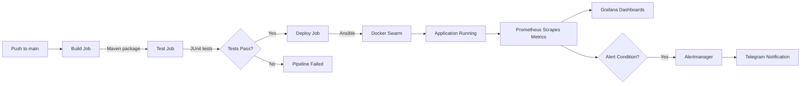

# CI/CD Pipeline

A complete CI/CD pipeline demonstrating automated build, test, and deployment workflows with comprehensive monitoring and alerting.


## Overview

This project implements a production-ready CI/CD pipeline that automatically builds, tests, and deploys a containerized application to a Docker Swarm cluster. It includes a full observability stack for monitoring, logging, and alerting.

### Key Features

- **Automated CI/CD** — GitHub Actions workflow with build, test, and deploy stages
- **Infrastructure as Code** — Vagrant for VM provisioning, Ansible for configuration management
- **Container Orchestration** — Docker Swarm for deployment and scaling
- **Monitoring** — Prometheus for metrics collection, Grafana for visualization
- **Logging** — Loki + Promtail for centralized log aggregation
- **Alerting** — Alertmanager with Telegram notifications

## Architecture


## Pipeline Flow



## Project Structure

```
cicd-pipeline/
├── .github/workflows/
│   └── ci.yml              # GitHub Actions pipeline
├── ansible/
│   ├── deploy.yml          # Deployment playbook
│   └── inventory.ini       # Host configuration
├── monitoring/
│   ├── alertmanager.yaml.example
│   ├── alert_rules.yaml    # Prometheus alert rules
│   ├── docker-compose.yaml # Monitoring stack
│   ├── loki-config.yaml
│   ├── prometheus.yaml
│   └── promtail-config.yaml
├── src/                    # Application source code
├── docker-compose.yaml     # Application deployment
├── Dockerfile
├── Makefile               # Deployment shortcuts
├── pom.xml                # Maven configuration
└── Vagrantfile            # VM provisioning
```

## Getting Started

### Prerequisites

- [Vagrant](https://www.vagrantup.com/downloads) + [VirtualBox](https://www.virtualbox.org/wiki/Downloads)
- [Docker Desktop](https://www.docker.com/products/docker-desktop)
- [Git](https://git-scm.com/downloads)
- Java 17+ (for local development)

### 1. Clone and Start VM

```bash
git clone https://github.com/Jamolov-Isroilbek/cicd-pipeline.git
cd cicd-pipeline
vagrant up
```

### 2. Configure GitHub Secrets

In your GitHub repository, go to **Settings → Secrets → Actions** and add:

| Secret | Description |
|--------|-------------|
| `SSH_PRIVATE_KEY` | Contents of `~/.vagrant.d/insecure_private_key` |

### 3. Set Up Self-Hosted Runner

```bash
# SSH into the VM
vagrant ssh deployment_vm

# Install and configure GitHub Actions runner
mkdir ~/actions-runner && cd ~/actions-runner
curl -o actions-runner-linux-x64-2.331.0.tar.gz -L https://github.com/actions/runner/releases/download/v2.331.0/actions-runner-linux-x64-2.331.0.tar.gz
tar xzf ./actions-runner-linux-x64-2.331.0.tar.gz
./config.sh --url https://github.com/YOUR_USERNAME/cicd-pipeline --token YOUR_TOKEN
./run.sh
```

### 4. Configure Monitoring (Optional)

```bash
cd monitoring

# Copy and edit the config files
cp alertmanager.yaml.example alertmanager.yaml
cp .env.example .env

# Edit .env with your Telegram bot credentials
# Then start the monitoring stack
docker-compose up -d
```

## Usage

### Deploy Application

Push to the `main` branch to trigger the pipeline:

```bash
git add .
git commit -m "Deploy update"
git push origin main
```

Or deploy manually:

```bash
make deploy
```

### Access Services

| Service | URL | Credentials |
|---------|-----|-------------|
| Application | http://192.168.56.101:8081 | — |
| Grafana | http://192.168.56.101:3000 | admin / (see .env) |
| Prometheus | http://192.168.56.101:9090 | — |
| Alertmanager | http://192.168.56.101:9093 | — |

### Test Alerts

```bash
curl -X POST http://localhost:9093/api/v2/alerts \
  -H "Content-Type: application/json" \
  -d '[{
    "labels": {"alertname": "TestAlert", "severity": "warning"},
    "annotations": {"title": "Test", "message": "Testing alerts!"}
  }]'
```

## Monitoring & Alerts

### Configured Alerts

| Alert | Condition | Severity |
|-------|-----------|----------|
| HostOutOfDiskSpace | Disk usage > 90% | Warning |
| HostHighCpuLoad | CPU > 80% for 2min | Warning |
| HostOutOfMemory | Memory < 10% available | Warning |
| ContainerCpuUsage | Container CPU > 80% | Warning |
| ContainerMemoryUsage | Container memory > 80% | Warning |

### Telegram Notifications

Alerts are sent to Telegram with detailed information:

```
🔥 [FIRING] HostHighCpuLoad
🚨 Alert: Host high CPU load
🛎️ Severity: ⚠️ warning
ℹ️ Description: CPU load is > 80%
```

## Tech Stack

| Category | Technologies |
|----------|--------------|
| CI/CD | GitHub Actions, Maven |
| Containerization | Docker, Docker Swarm |
| Infrastructure | Vagrant, VirtualBox, Ansible |
| Monitoring | Prometheus, Grafana, Alertmanager |
| Logging | Loki, Promtail |
| Application | Java 17, Spring Boot |

## Development

### Run Locally

```bash
# Build
mvn clean package

# Run
java -jar target/hello-0.0.1-SNAPSHOT.war

# Access at http://localhost:8080
```

### Run Tests

```bash
mvn test
```

## Troubleshooting

<details>
<summary><b>VM won't start</b></summary>

Ensure VirtualBox is installed and virtualization is enabled in BIOS:
```bash
vagrant destroy -f
vagrant up
```
</details>

<details>
<summary><b>Pipeline fails at Deploy</b></summary>

1. Check self-hosted runner is running: `./run.sh`
2. Verify SSH key is correctly set in GitHub Secrets
3. Ensure VM is accessible: `ping 192.168.56.101`
</details>

<details>
<summary><b>Alertmanager not starting</b></summary>

Check if `alertmanager.yaml` has valid values (not placeholders):
```bash
docker-compose logs alertmanager
```
</details>

<details>
<summary><b>Telegram alerts not working</b></summary>

1. Verify bot token and chat ID in `alertmanager.yaml`
2. Ensure bot is started (send `/start` to your bot)
3. Check Alertmanager logs for errors
</details>

## License

This project is licensed under the MIT License - see the [LICENSE](LICENSE) file for details.

## Author

**Isroilbek Jamolov** — [GitHub](https://github.com/Jamolov-Isroilbek)

---

<p align="center">
  <i>Built as a DevOps portfolio project demonstrating CI/CD best practices</i>
</p>
